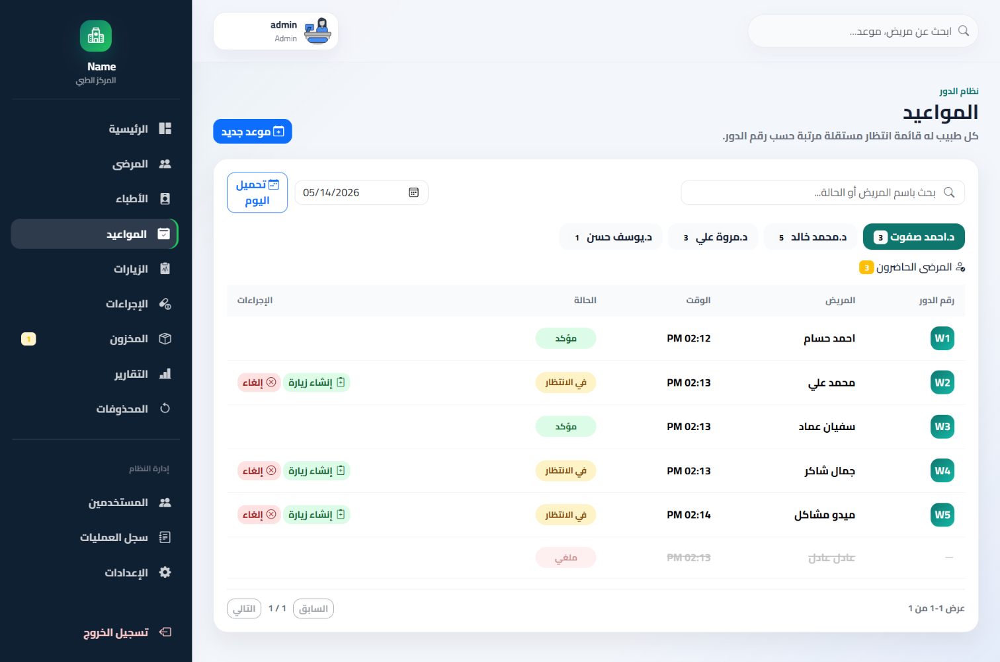
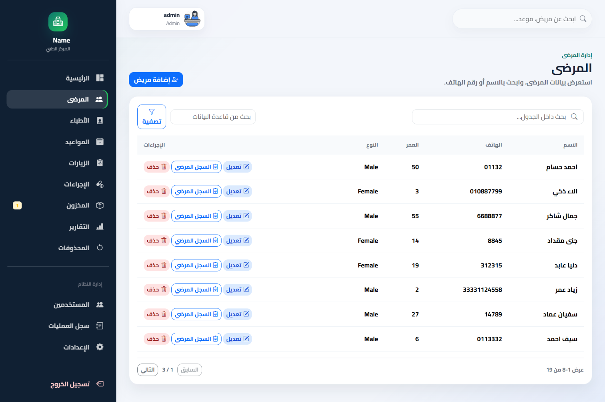
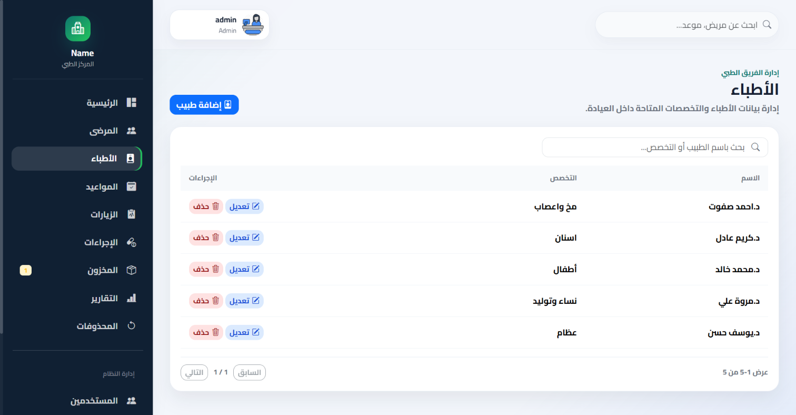
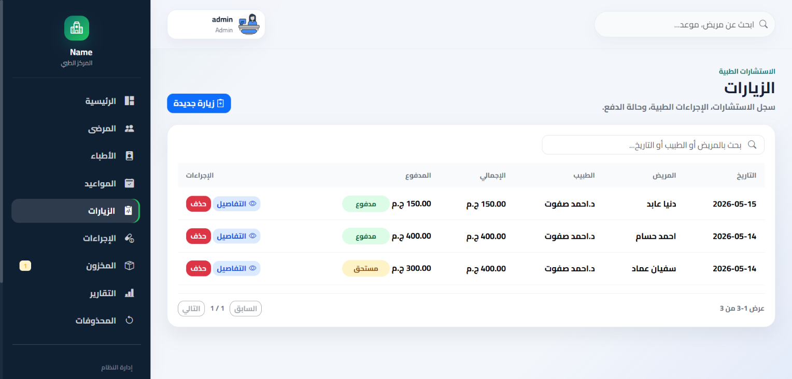

# 🏥 Clinical Management System

ASP.NET MVC-based Clinical Management System designed to manage patients, doctors, appointments, queue system, visits, prescriptions, and clinic workflows using clean architecture principles.

---

## 🚀 Features

- Multi-role Authentication & Authorization
- Patient & Doctor Management
- Appointment Scheduling System
- Dynamic Queue Management per Doctor
- Visit & Prescription Handling
- Dashboard for Clinic Overview
- Soft Delete System for safe data handling
- Search, Filtering & Validation
- Audit Logging for tracking changes

---

## 🛠️ Tech Stack

- ASP.NET MVC
- C#
- Entity Framework Core
- LINQ
- SQL Server
- HTML5 / CSS3
- JavaScript (Basic)
- Git & GitHub

---

## 🏗️ Architecture

- MVC Architecture
- Repository Pattern
- Service Layer
- Dependency Injection
- Clean Separation of Concerns

---

## 🗄️ Database Design

- Code First Approach (EF Core)
- One-to-Many Relationships
- Normalized Schema Design
- Data Integrity Constraints

---

## 🔐 Authentication & Authorization

- Cookie-Based Authentication
- Role-Based Access Control (Admin / Receptionist)
- Secure Route Protection

---

## 📸 Screenshots

### Dashboard

### Login

### Queue Management

### Patients

### Doctors

### Visits

---

## 📂 Documentation

Detailed system documentation, architecture decisions, and refactoring logs are available inside the `Docs/` folder.

---

## 🚧 Future Improvements

- RESTful API Integration (ASP.NET Core Web API)
- JWT Authentication
- Docker Deployment
- Cloud Hosting (Azure)
- Real-time Notifications System